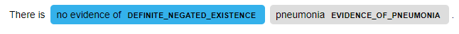
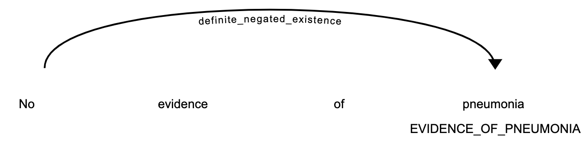

# cycontext
A Python implementation of the ConText algorithm for clinical text concept assertion using the spaCy framework

# Overview
This package implements the ConText algorithm within the [spaCy](https://spacy.io) framework. 
[ConText](https://www.sciencedirect.com/science/article/pii/S1532046409000744) detects semantic modifiers such as **negation**, 
**family history**, and **certainty** in clinical text by
relating target concepts (such as "pneumonia") with semantic modifiers (such as "no evidence of"). 

This builds on [pyConText](https://github.com/chapmanbe/pyConTextNLP), which extracts both targets and modifiers using
regular expressions and relates them using a NetworkX graph.

See `notebooks/` for detailed explanations and examples.

Before getting started, make sure you've installed [spacy](https://spacy.io/usage) 
and [downloaded a model](https://spacy.io/usage/models) (ie., **en_core_web_sm**).

# Key Features
- cycontext is used as a modular [spaCy component](https://spacy.io/usage/processing-pipelines)
- Modifiers are defined in a knowledge base which are used to modify target spans
- Results are stored in a custom attribute `Doc._.context_graph`
- Modifier -> target relationships are stored in `Doc._.context_graph.edges`

# Basic Usage

## Installation
You can install cycontext using pip:
```bash
pip install cycontext
```

Or clone this repository install cycontext using the `setup.py` script:
```bash
$ python setup.py install
```

Once you've installed the package and spaCy, make sure you have a spaCy language model installed (see https://spacy.io/usage/models):

```bash
$ python -m spacy download en_core_web_sm
```

In the future cycontext should be made available through conda.

## Example
```python
import spacy

from cycontext import ConTextComponent, ConTextItem

nlp = spacy.load("en_core_web_sm")
text = "There is no evidence of pneumonia."

###########################################
# Add code for extracting target concepts #
###########################################
doc = nlp(text)
print(doc.ents)
>>> (pneumonia,)

item_data = [ConTextItem("no evidence of", "DEFINITE_NEGATED_EXISTENCE", rule="forward")]
context = ConTextComponent(nlp)
context.add(item_data)
nlp.add_pipe(context, last=True)

doc = nlp(text)
print(doc._.context_graph.edges)
>>> [(pneumonia, <TagObject> [No evidence of, definite_negated_existence])]

for target in doc.ents:
    print(target._.is_experienced)

>>> False
```

## Visualization
We can use [spaCy's visualizers](https://spacy.io/usage/visualizers) to display the results of cycontext.
This NER-style visualization highlights the targets and modifiers in text:

```python
from cycontext import viz
viz.visualize_ent(doc)
``` 

<p align="center"></p>

While this dependency-style visualization shows the relationships between targets and modifiers:
```python
viz.visualize_dep(doc)
``` 
<p align="center"></p>

## Tests
To run tests:
```bash
cd cycontext
pytest tests
```


# Contact Information
Alec Chapman: abchapman93@gmail.com
